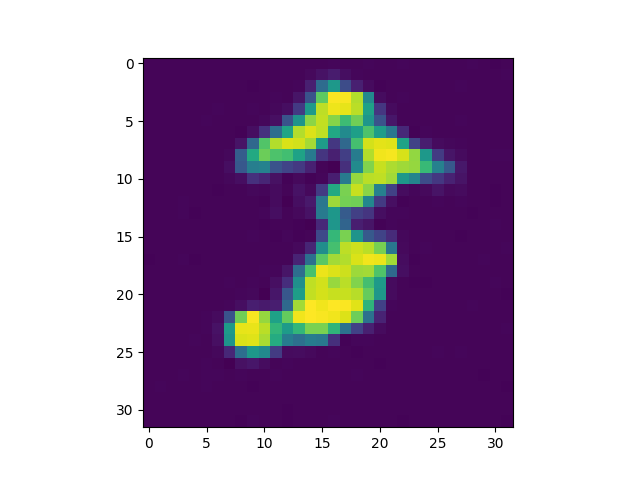
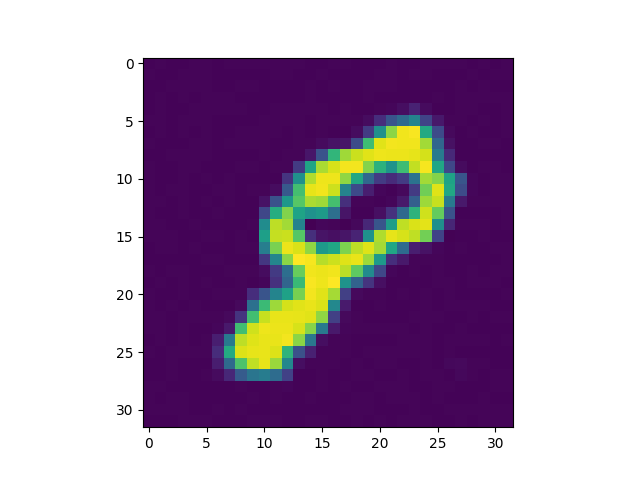
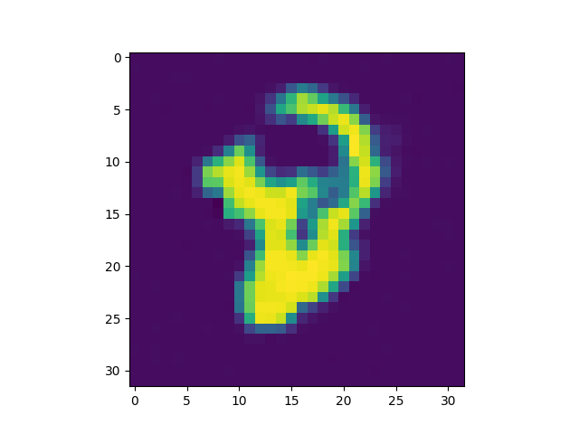
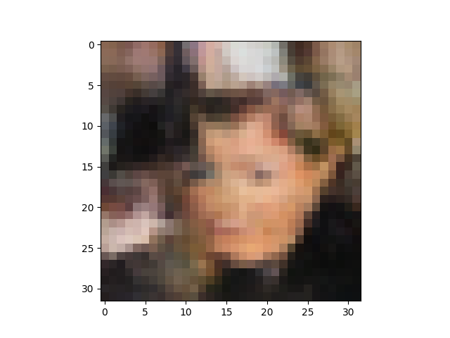
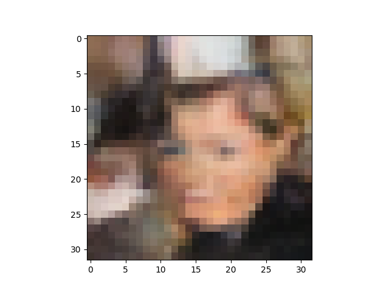

# **RealNVP based training for MNIST and celeba dataset**

## **Setup**
```
pip install -r requirements.txt
```

## **Training**
```
python train.py --no_cuda False --root root_path
```

The architecture has been taken from the official implementation from [tensorflow](https://github.com/tensorflow/models/tree/archive/research/real_nvp)
The inference after each epoch is generated under the *sample* directory

## **Samples**

### *MNIST*




### *Celeba*


